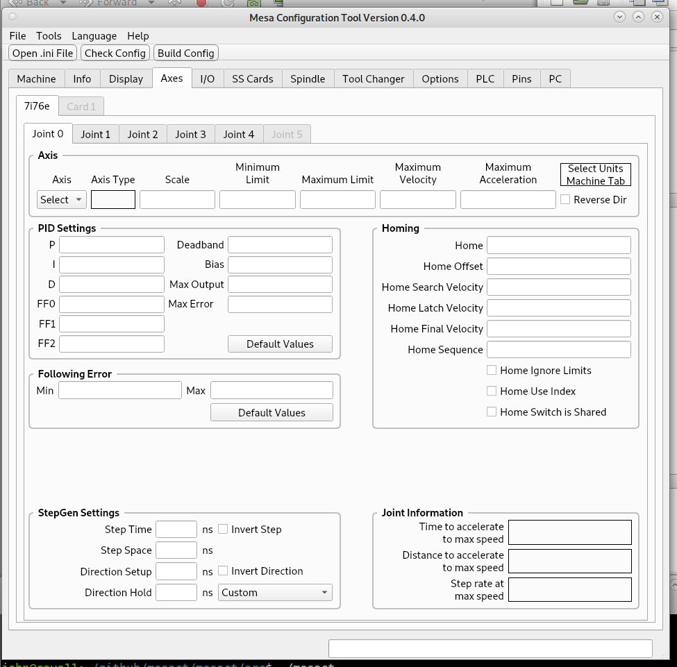
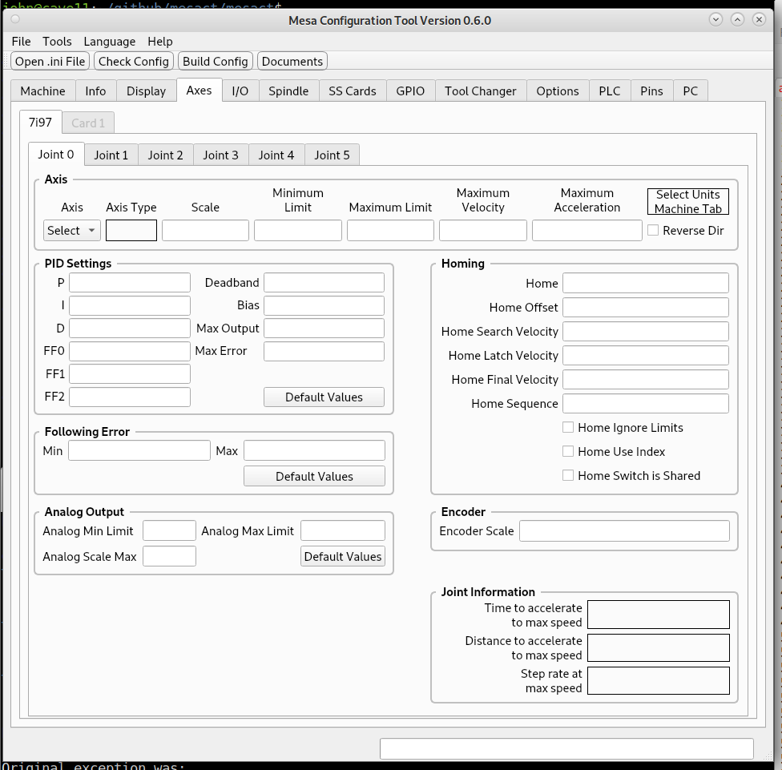

Axes Tab
========

Axis Group
----------

#. Select the type of Axis

#. Enter the Scale which is the number of pulses to move one user unit.
   (user unit is either inch or mm)

#. Enter the Minimum Limit for the Axis (usually 0 for X or Y and the
   amount of travel for the Z axis as a negative number

#. Enter the Maximum Limit for the Axis (usually max travel for X or Y
   and 0 for Z)

#. Enter the Maximum Velocity in user units per second

#. Enter the Maximum Acceleration in user units per second per second

#. If the direction is backwards after testing check Reverse Direction

PID Settings Group
------------------

* Usually the Default Values are correct

* If you change the Tread Period in the Options tab generate the PID
  settings again.

The physical meaning of P=1/servo_period (1000 for a 1 ms servo period)
is that any position errors are corrected before the next servo thread
invocation. 

Anything greater than P=1/Servo_period means you will over-correct.

Anything less than P=1/Servo_period means you will under-correct.

Anything greater than P=2/Servo_period means you will have oscillations.

If you are using PID feedback for a stepgen P=1/Servo_period is pretty
much necessary. PID is still used with stepgens without encoders as it
has advantages over the built-in position mode

In addition you can use a bit of FF2 (FF2= seconds between position read
and new velocity write) usually about 0.0001 for Ethernet cards

Following Error Group
---------------------

#. Usually the Default Values are correct 

Homing Group
------------

All entries are optional with the exception of a gantry configuration
with two or more axes with the same Axis Letter. In this case you must
enter the Home Sequence for all Joints used by the gantry.

#. Home is usually 0

#. Home Offset can be used to move the joint off of a home switch

#. Home Search Velocity is the "fast" speed to find the home switch

#. Home Latch Velocity is the "slow" speed to get an accurate location
   of the home switch

#. Home Final Velocity is the speed that joint moves to home positon,
   if left blank the a rapid move is used

#. Home Sequence defines the order that the axes home, it must start
   1 or 0 and is negative in the case of a gantry

Step and Direction Drives

StepGen Settings Group
----------------------

Either enter in the values for your drive or select your drive from the
combo box. The Custom can be changed for your drive name if desired.

Analog Drives

Analog Output Group
-------------------

Usually the Default Values are correct

Encoder Group
-------------

Enter the scale for your encoder for one user unit
