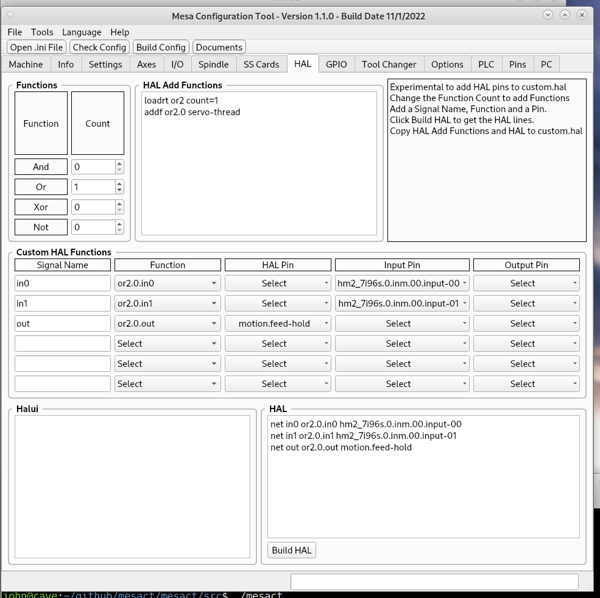

HAL
===

Build custom HAL commands and copy and paste them into your custom.hal file.

#.	Change the count of a function to greater than 0 and in the HAL Add Functions
	window the commands to add the function and add function to the servo-thread
	are shown.

#.	Create a signal name, pick the function and select a pin.

#.	Click on Build HAL to get the code to copy and past to your custom.hal file
	after the HAL Add Functions code.

Note: This section does not check for duplicate functions that may be in another
hal file.
