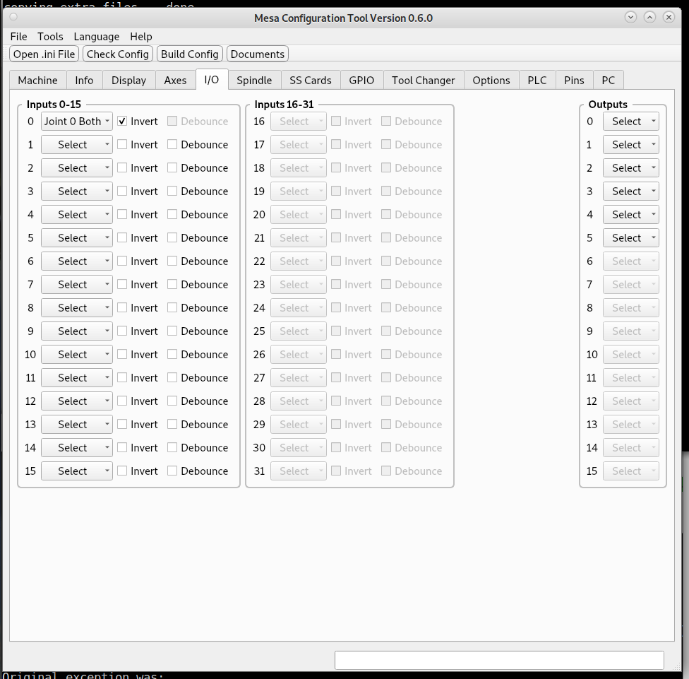

I/O Tab
=======

Inputs
------

Select the input function from the combo box. To deselect pick Select
from Not Used.

If you need to invert the sense of the input check Invert.

Some cards have a built in debounce function. If you check Debounce then
Invert is not avaliable and the same goes if you check Invert then
Debounce is not avaliable.

Inputs are enabled based on the board in the case of an all in one board
or the daughter card.

Outputs
-------

Select the output function from the combo box.  To deselect pick Select
from Not Used.
