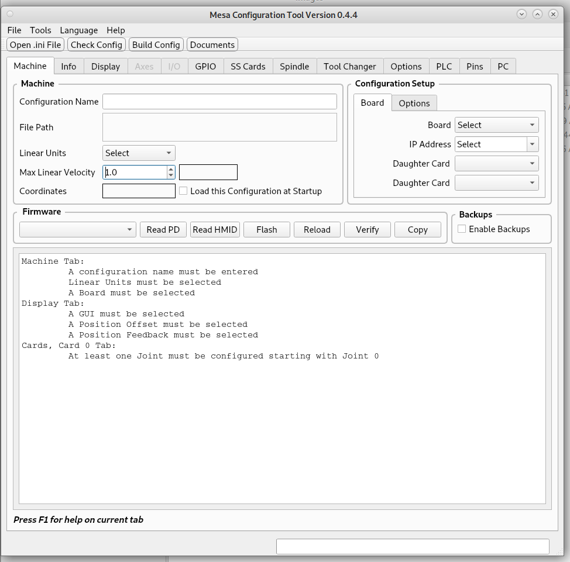

Machine Tab
===========

Menu
----

File
^^^^

* `Open .ini File` - Opens a file selector so you can pick an ini file
  to load, same as the Tool Bar button

Tools
^^^^^

* `Check Config` - Checks the Configuration for errors
* `Build Config` - Builds the Congiguration after checking for errors

Language
^^^^^^^^

Select the language to use, currently German is mostly translated.

Help
^^^^

* `Tab Help` - Displays help information for the current tab, same as F1

Tool Bar
--------

* `Open .ini File` - Opens a file selector so you can pick an ini file to load
* `Check Config` - Checks the Configuration for errors
* `Build Config` - Builds the Congiguration after checking for errors
* `Documents` - Opens the PDF Documents

Machine Group
-------------

* `Configuration Name` - Any letter or number or underscore. Spaces are
  replaced by an underscore.
* `File Path` - Displays the full path to the configuration.
* `Linear Units` - Select base units for the configuration.
* `Max Linear Velocity` - Set the Maximum Linear Velocity for all axes
  combined in Linear Units per second.
* `Coordinates` - Displays the current configuration Coordinates by Axis

Configuration Setup
-------------------

* `Board Tab`

* `Board` - Select the main board being used.
* `IP Address` - If the main board is an Ethernet Board select the IP
  address of the board.
* `Daughter Card` - After selecting the firmware you can select a daugher
  card for which header you're using. The header numbers are added to
  the Daughter Card when a board is selected. At this time only one
  daughter card is supported.

* `Options Tab`

After selecting a `Firmware` the Options are populated. Select a lower
amount to free up GPIO on some boards. 

* `Step Generators`
* `PWM Generators`
* `Encoders`

Firmware
--------

After selecting a board the Firmware combobox is populated with firmware
for that board.

* `Read PD` - Read Pin Descriptions, gives more information than Read HMID
* `Read HMID` - Shows General Configuration Information
* `Flash` - After selecting a firmware this will flash the board
* `Reload` - After flashing firmware this will reload the new firmware
* `Verify` - After the board boots up this will verify the selected firmware
* `Copy` - Copies the contents of display window to the clipboard

Backups
-------

* `Enable Backups` - When this is checked a backup copy is saved to a
  .zip file in the backups directory before building a new configuration.
  The backup file is named with the date and time of the save.
