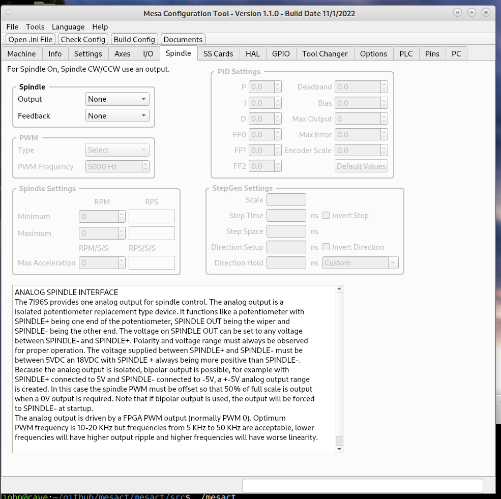

Spindle
=======

On the Spindle Tab you can create Analog, Digital or Stepgen spindle.

For a Digital Spindle select the outputs to be used on the I/O tab or on the
SS Cards tab.

Notes about the card if any are shown in the lower window.
